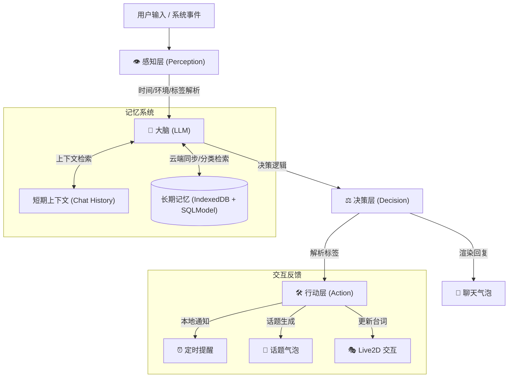

<div align="center">

<h1>Peroperochat — 你的全能 AI 虚拟伙伴</h1>

<p>一个集成了 Live2D 交互、云端同步长记忆系统与主动提醒机制的跨平台 AI 智能体项目</p>


<a href="https://github.com/YoKONCy/Perocore">
  
</a>


<p>
  <b>“不仅仅是聊天机器人，更是能感知时间、拥有持久记忆并跨设备同步的虚拟伙伴。”</b>
</p>

</div>

---

📋 **目录 / Table of Contents**

- [🎯 Overview - 项目概述](#-overview---项目概述)
- [🤖 AI Agent - 智能体架构](#-ai-agent---智能体架构)
- [🧠 Memory System - 记忆系统](#-memory-system---记忆系统)
- [🏗️ Architecture - 系统架构与技术栈](#️-architecture---系统架构与技术栈)
- [🚀 Quick Start - 快速开始](#-quick-start---快速开始)
- [⚠️ Disclaimer - 免责声明](#️-disclaimer---免责声明)

---

### 🎯 Overview - 项目概述

**Peroperochat** 是一款专注于沉浸式陪伴的 AI 智能体。它突破了传统 AI “问答式”的局限，通过移动端（Capacitor）与桌面端（PeroCore）的深度联动，打造了一个具有连续生命感的虚拟形象。

✨ **核心特色**

- 🎭 **Live2D 深度集成**: 支持模型换装、随机动作、以及根据聊天内容实时更新的交互台词。
- 🫧 **拟物化气泡 UI**: 采用 Glassmorphism（毛玻璃）设计风格，Pero 的回复像吹出的泡泡一样自然漂浮。
- ⏰ **主动提醒与通知**: 自动识别约定并生成任务气泡。移动端支持 **Local Notifications**，即使应用关闭也能收到 Pero 的提醒。
- 🤫 **动态话题机制**: 遵循最新的 2-8 小时时间策略，Pero 会在合适的时机产生“想聊的话题”，增强互动的真实感。
- 🌐 **跨端兼容性**: 移动端通过 API 与 [PeroCore](https://github.com/YoKONCy/Perocore) 后端同步，实现记忆与状态的无缝衔接。

---

### 🤖 AI Agent - 智能体架构

Peroperochat 采用统一的提示词架构，确保移动端与桌面端逻辑高度一致。



1. **Perception (感知层)**: 自动注入现实时间、地点、天气及用户状态。
2. **Brain (大脑)**: 遵循统一的 `System_Core` 与 `Output_Constraint` 约束，生成带标签的结构化响应。
3. **Action (行动层)**: 解析 `<MEMORY>`, `<PEROCUE>`, `<REMINDER>`, `<TOPIC>` 等标签，触发 UI 交互或系统通知。

---

### 🧠 Memory System - 记忆系统

我们设计了**双轨同步记忆机制**，确保 Pero 在任何设备上都记得你：

- **本地存储 (IndexedDB)**: 基于 Dexie.js v3，存储包含 `type`（类型）和 `source`（来源）的结构化记忆，保证离线可用与极速检索。
- **云端同步**: 移动端生成的记忆会实时同步至 [PeroCore](https://github.com/YoKONCy/Perocore) 后端。
- **分类检索**: 记忆分为 `event` (事件)、`fact` (事实)、`preference` (偏好) 等类型，提升 RAG 检索的精准度。
- **重要性评估**: AI 自动为每条记忆打分 (1-10)，优先保留深刻的情感连接。

---

### 🏗️ Architecture - 系统架构与技术栈

- **前端核心**: [Vue 3](https://vuejs.org/) + [Vite](https://vitejs.dev/)
- **移动框架**: [Capacitor 6](https://capacitorjs.com/) (Haptics 震动反馈、Local Notifications 通知)
- **后端支持**: [FastAPI](https://fastapi.tiangolo.com/) + [SQLModel](https://sqlmodel.tiangolo.com/) (PeroCore)
- **数据库**: [Dexie.js](https://dexie.org/) (移动端) / [SQLite](https://www.sqlite.org/) (后端)
- **Live2D**: [Live2D Cubism SDK](https://www.live2d.com/en/)

📁 **核心目录结构**

```bash
Peroperochat/
├── src/
│   ├── api.js           # 核心 API 与 2-8h 话题策略逻辑
│   ├── db.js            # Dexie v3 数据库 Schema
│   └── pages/           # MobileHome 交互逻辑
├── PeroCore/
│   └── backend/         # FastAPI 后端，提供记忆同步服务
├── public/              # Live2D 模型与静态资源
└── capacitor.config.ts  # 移动端跨平台配置
```

---

### 🚀 Quick Start - 快速开始

1. **安装依赖**
   ```bash
   npm install
   ```

2. **启动开发环境**
   ```bash
   npm run dev
   ```

3. **与 PeroCore 后端联动**
   - 进入 `PeroCore/backend` 目录并启动后端服务。
   - 在移动端设置中配置正确的 `API Base URL`。

4. **打包移动端**
   ```bash
   npx cap sync
   ```

---

### ⚠️ Disclaimer - 免责声明

- 本项目仅供学习交流使用，完全非盈利。
- 请遵守当地法律法规，严禁用于任何非法用途。

---

<div align="center">
  <p>Made with ❤️ by YoKONCy & AI Team</p>
  <p>© 2025-2026 YoKONCy. Licensed under GNU General Public License v3.0.</p>
</div>
