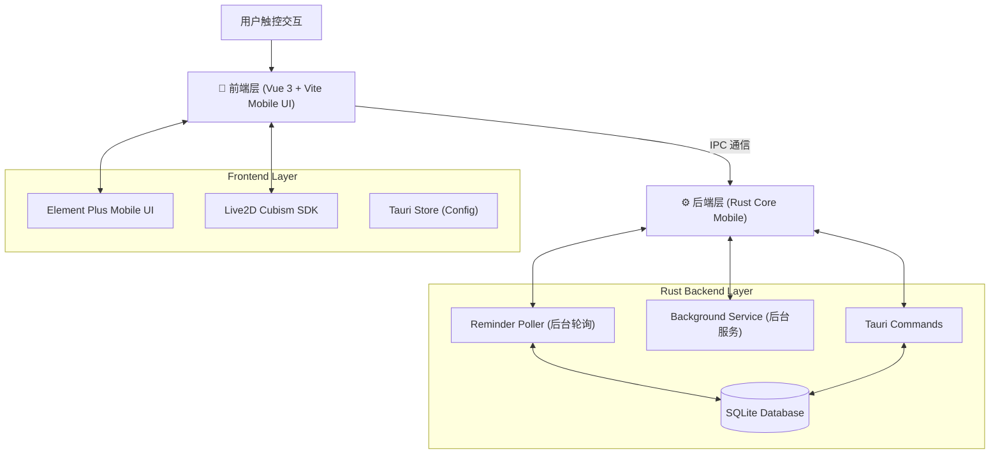

<div align="center">

<h1>PeroperoChat — 你的全能 AI 虚拟伙伴</h1>

<p>一个集成了 Live2D 交互、Rust 本地高性能后端、智能提醒与长期记忆系统的跨平台移动端 AI 智能体项目</p>


<p>
  <b>“不仅仅是聊天机器人，更是能感知时间、拥有持久记忆并时刻陪伴在你身边的虚拟伙伴。”</b>
</p>

</div>

---

📋 **目录 / Table of Contents**

- [🎯 Overview - 项目概述](#-overview---项目概述)
- [✨ Key Features - 核心特性](#-key-features---核心特性)
- [🏗️ Architecture - 系统架构](#️-architecture---系统架构)
- [🚀 Quick Start - 快速开始](#-quick-start---快速开始)
- [⚠️ Disclaimer - 免责声明](#️-disclaimer---免责声明)

---

### 🎯 Overview - 项目概述

**PeroperoChat** 是一款基于 **Tauri v2 Mobile** 构建的现代化 AI 移动端伙伴。它结合了 Web 前端的灵活性与 Rust 后端的高性能，提供了一个沉浸式的虚拟伴侣体验。

项目采用 **Rust Native** 架构，利用 SQLite 实现本地数据隐私保护与高效检索，同时支持后台保活、系统通知与智能循环提醒，完美适配 Android 与 iOS 设备。

---

### ✨ Key Features - 核心特性

- 🎭 **Live2D 深度集成**: 支持模型换装、触摸反馈、以及根据聊天内容实时更新的情感与动作，专为移动端触控优化。
- 🦀 **Rust 强力驱动**: 
  - **后台服务**: 高效的后台常驻服务，确保应用在后台也能响应。
  - **高性能存储**: 内置 SQLite 数据库，毫秒级读写记忆与配置。
  - **原生能力**: 深度集成移动端系统通知、文件系统与硬件震动反馈。
- ⏰ **智能提醒系统**:
  - **循环任务**: 支持每日/每周循环提醒，自动计算下次触发时间。
  - **持久化轮询**: 后台 Rust 进程每 30 秒检查一次提醒，确保不错过任何重要事项。
  - **送达状态追踪**: 记录提醒送达状态，支持“稍后提醒”与过期处理。
- 🧠 **长期记忆系统**:
  - **本地隐私**: 所有记忆数据存储于本地 SQLite，无需上传云端即可实现 RAG（检索增强生成）。
- 💬 **沉浸式交互**:
  - **拟物化 UI**: 气泡式对话界面，支持流式输出 (Streaming Response)。
  - **多模型支持**: 兼容 OpenAI 格式接口，支持自定义模型配置。

---

### 🏗️ Architecture - 系统架构

PeroperoChat 采用 **Tauri v2 Mobile** 双层架构，确保在移动设备上的高性能与低功耗。


```mermaid
graph TD
    User["用户触控交互"] --> Frontend["📱 前端层 (Vue 3 + Vite Mobile UI)"]
    Frontend -->|IPC 通信| Backend["⚙️ 后端层 (Rust Core Mobile)"]
    
    subgraph Frontend Layer
        UI["Element Plus Mobile UI"]
        L2D["Live2D Cubism SDK"]
        Store["Tauri Store (Config)"]
    end
    
    subgraph Rust Backend Layer
        Command["Tauri Commands"]
        Service["Background Service (后台服务)"]
        Poller["Reminder Poller (后台轮询)"]
        DB[(SQLite Database)]
    end
    
    Frontend <--> UI
    Frontend <--> L2D
    
    Backend <--> Command
    Backend <--> Service
    Backend <--> Poller
    Poller <--> DB
    Command <--> DB
```

#### 技术栈详情

- **前端**: Vue 3, Vite, Element Plus, TypeScript
- **后端**: Rust, Tauri v2 Mobile
- **数据库**: Rusqlite (SQLite)
- **插件**: 
  - `@tauri-apps/plugin-store`: 配置持久化
  - `@tauri-apps/plugin-notification`: 系统通知
  - `@tauri-apps/plugin-shell`: 系统命令执行
  - `@tauri-apps/plugin-haptics`: 触感反馈

---

### 🚀 Quick Start - 快速开始

#### 环境要求

- **Node.js**: v18+
- **Rust**: 最新稳定版 (建议通过 rustup 安装)
- **移动端环境**: Android Studio (Android) 或 Xcode (iOS)
- **包管理器**: pnpm (推荐) 或 npm/yarn

#### 安装与运行

1. **克隆仓库**
   ```bash
   git clone https://github.com/YoKONCy/PeroperoChat.git
   cd PeroperoChat
   ```

2. **安装依赖**
   ```bash
   pnpm install
   ```

3. **初始化移动端项目**
   ```bash
   pnpm tauri android init
   # 或
   pnpm tauri ios init
   ```

4. **真机/模拟器调试**
   ```bash
   # Android
   pnpm tauri android dev
   
   # iOS
   pnpm tauri ios dev
   ```

---

### ⚠️ Disclaimer - 免责声明

本项目仅供学习与技术交流使用。
- Live2D 模型版权归原作者所有。
- 请勿将本项目用于任何非法用途。
- AI 生成内容可能存在幻觉，请注意甄别。

---

<div align="center">
  Made with ❤️ by the PeroperoChat Team
</div>
